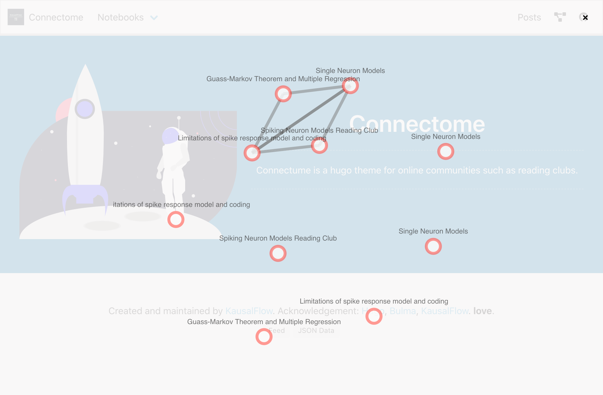
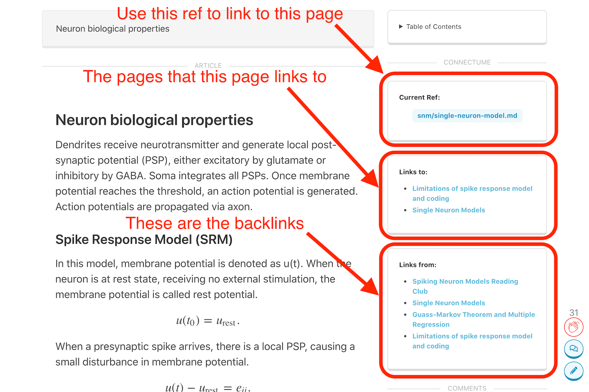

# Hugo Connectome Theme

A [Hugo](http://gohugo.io/) theme for online community notes with backlinks.

## How to Use

### Starting from Scratch

Fork [this repo](https://github.com/kausalflow/hugo-connectome-theme-demo) and revise it to your needs.

### Include this theme to your existing Hugo site

- Add the theme `git submodule add https://github.com/kausalflow/connectome themes/connectome`;
- Use the contents in `themes/connectome/exampleSite` as boilerplate.

## Acknowledgement

- This theme is developed on top of [the Hugo Bulma theme](https://github.com/jeblister/bulma/)
- The network graph is visualized using [netjsongraph.js](https://github.com/openwisp/netjsongraph.js)

