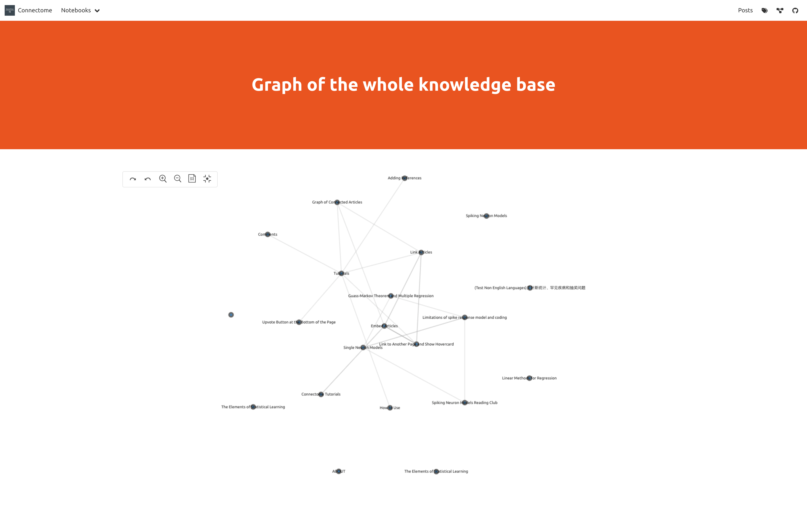
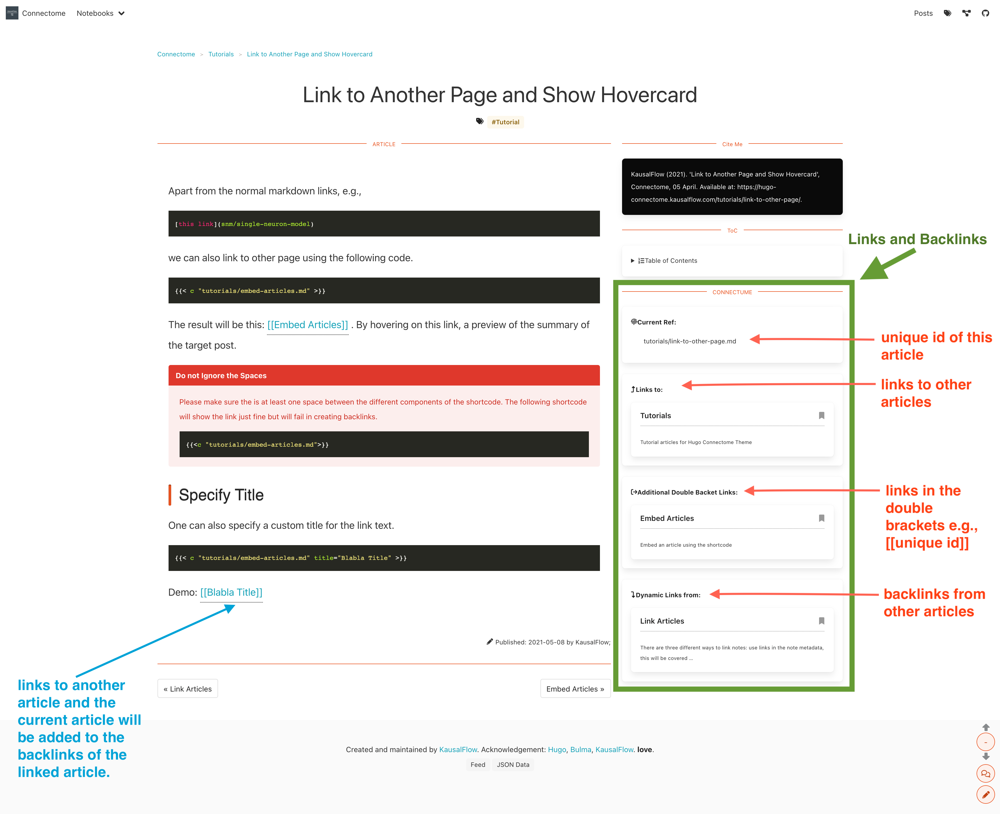
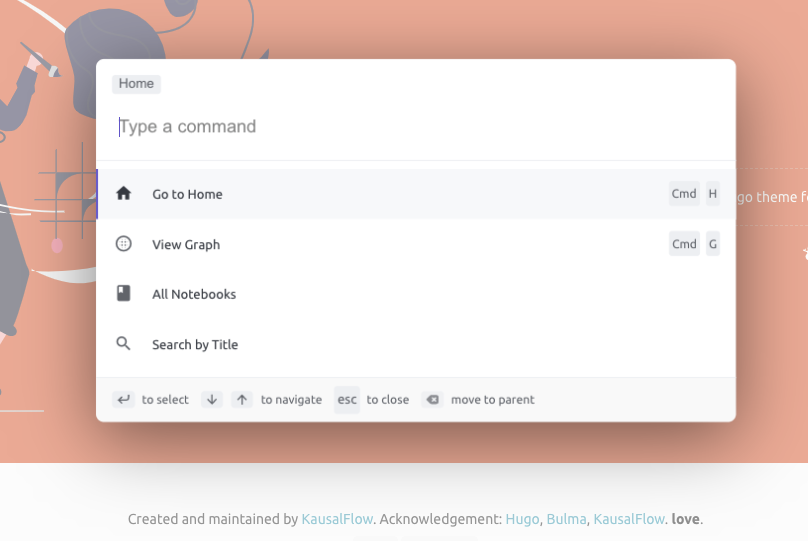
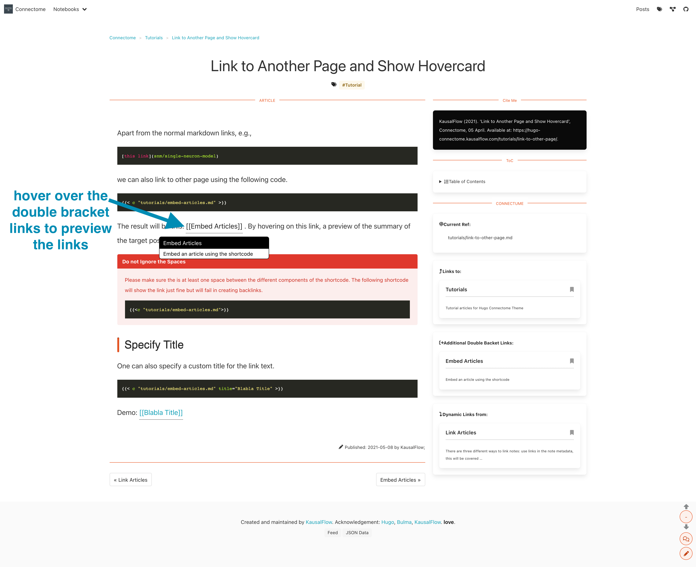
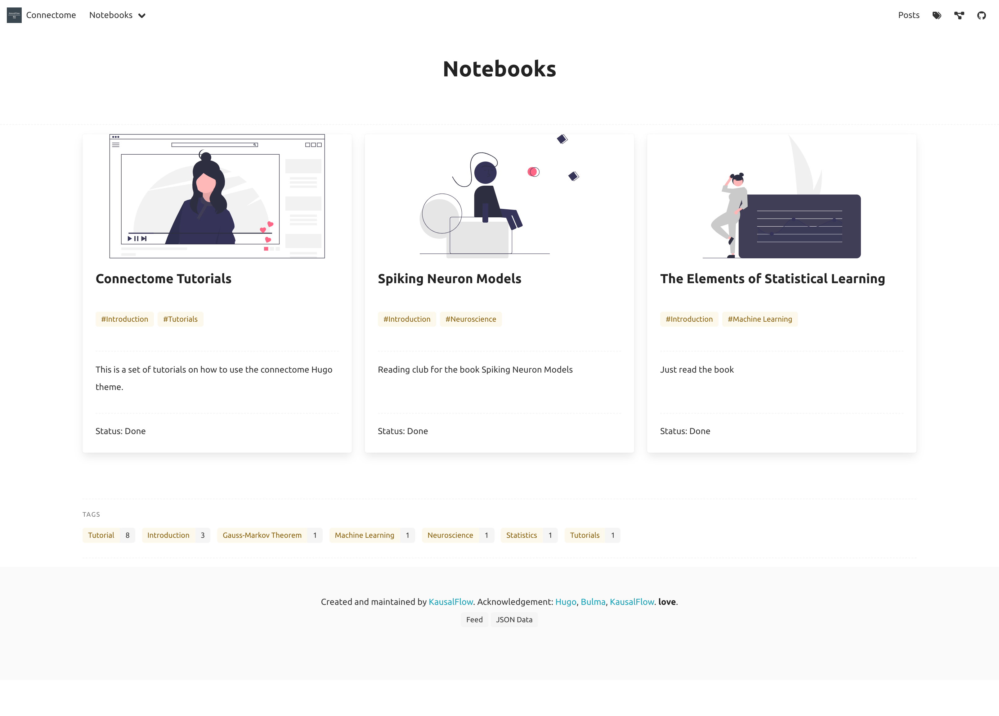

# Hugo Connectome Theme

A [Hugo](http://gohugo.io/) theme for online community notes with backlinks.

| graph | links and backlinks | command palette |
|----|----|----|
|   |   |    |

| preview links | Multiple Topics/Notebooks |
|----|----|
|   |   |

## How to Use

> If one is not familiar with Hugo, the official website has a nice tutorial: [Hugo Quickstart and Basics](https://gohugo.io/getting-started/quick-start/).

### Starting from Scratch

Simply fork [this repo](https://github.com/kausalflow/hugo-connectome-theme-demo) and modify the config file `config.yaml`.

### Use this theme in an existing Hugo site

- Add the theme `git submodule add https://github.com/kausalflow/connectome themes/connectome`;
- Use the contents in `themes/connectome/exampleSite` as boilerplate.

## Acknowledgement

- This theme is developed on top of [the Hugo Bulma theme](https://github.com/jeblister/bulma/)
- The network graph is visualized using [AntV G6](https://g6.antv.vision/)

